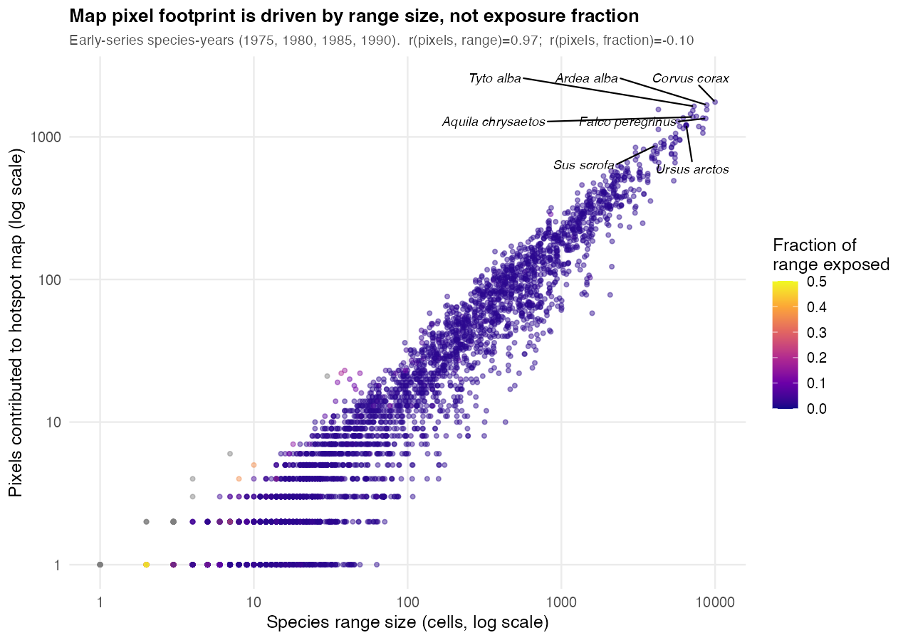

# Large-range species dominate the early-series hotspot map

**Question.** In the early years of the series, are some species contributing
many pixels to the hotspot map simply because they have huge ranges — so that
1% of their range is a large absolute number of cells and always clears the
`propExposed > 1%` inclusion filter?

**Answer: yes, strongly.** This is a structural consequence of a
*range-fraction* inclusion rule combined with an *absolute cell count* on the
map. A species that clears the 1% threshold contributes *all* its exposed cells
that year to the map; for a species with a 5,000–10,000-cell range, "just over
1%" is still 100–1,750 cells.

## Evidence (years explored: 1975, 1980, 1985, 1990)

Reproduce with [`large_range_species_analysis.R`](large_range_species_analysis.R).
For each species-year I counted `pixels` = distinct range cells the species
contributes to the map (across all variables), and `propExposed` = its
range-fraction exposed that year.

- **`cor(pixels, range size) = 0.97`** — a species' pixel footprint is almost
  entirely explained by how large its range is.
- **`cor(pixels, fraction exposed) = -0.10`** — contributing many pixels has
  essentially *no* relationship to a large fraction of the range being exposed.
- The **top 25 pixel contributors all sit at `propExposed = 0.02`** — i.e. right
  at the 1–2% floor, barely clearing the filter — yet each puts 800–1,750 pixels
  on the map.
- Median range size is **81 cells** for a typical species vs **5,889 cells** for
  the top-25 contributors.

The points highest on the y-axis (most pixels) are uniformly dark (lowest
fraction exposed). The map's early-year "hotspots" are therefore dominated by a
handful of globally widespread, common species whose exposure is a trivial
fraction of their range.

## The species (top 20 by mean pixels on the map, 1975–1990)

All are cosmopolitan, Least-Concern taxa; `mean_frac` is the mean fraction of
range exposed across the explored years (full table in
[`large_range_species_earlyyears.csv`](large_range_species_earlyyears.csv)).

| species | range size (cells) | mean pixels on map | mean fraction of range exposed |
|---|---:|---:|---:|
| Corvus corax (common raven) | 9,994 | 1,755 | 0.02 |
| Tyto alba (barn owl) | 7,289 | 1,638 | 0.02 |
| Ardea alba (great egret) | 8,824 | 1,612 | 0.02 |
| Hirundo rustica (barn swallow) | 7,158 | 1,527 | 0.02 |
| Bubulcus ibis (cattle egret) | 6,923 | 1,449 | 0.02 |
| Himantopus himantopus (black-winged stilt) | 7,553 | 1,392 | 0.02 |
| Aquila chrysaetos (golden eagle) | 7,165 | 1,379 | 0.02 |
| Falco peregrinus (peregrine falcon) | 8,692 | 1,347 | 0.02 |
| Anas platyrhynchos (mallard) | 4,275 | 1,342 | 0.02 |
| Butorides striata (striated heron) | 5,727 | 1,287 | 0.02 |
| Nycticorax nycticorax (black-crowned night heron) | 6,199 | 1,254 | 0.02 |
| Ursus arctos (brown bear) | 6,482 | 1,204 | 0.02 |
| Lagopus lagopus (willow ptarmigan) | 8,323 | 1,189 | 0.02 |
| Ardea cinerea (grey heron) | 5,889 | 1,184 | 0.02 |
| Anas crecca (Eurasian teal) | 7,832 | 1,182 | 0.02 |
| Saxicola torquatus (African stonechat) | 5,531 | 1,011 | 0.02 |
| Sterna hirundo (common tern) | 5,155 | 987 | 0.02 |
| Gallinula chloropus (common moorhen) | 5,886 | 952 | 0.02 |
| Falco subbuteo (Eurasian hobby) | 5,487 | 914 | 0.02 |
| Tachybaptus ruficollis (little grebe) | 4,644 | 889 | 0.02 |

## Why this matters and options

The inclusion rule ("> 1% of range exposed that year") is scale-free, but the
*visual weight* on the map is not — it is the raw cell count. So the map's early
years foreground widespread generalists at the exact moment their exposure is
least meaningful (2% of an enormous range). Options, if this is undesirable:

1. **Weight or normalise the per-cell count** by species range size (e.g. count
   `1/rangeSize` per species per cell) so each species contributes comparable
   total weight regardless of range.
2. **Raise the inclusion threshold** (e.g. >5% or >10% of range) — reduces but
   does not remove the effect, since it is proportional.
3. **Cap per-species pixel contribution**, or offer a "large-range species"
   toggle to exclude the top range-size percentile.
4. **Report both** raw counts and a range-normalised layer, and let the user
   switch — keeps the absolute hotspot map while exposing the artifact.

These are display/aggregation choices in the app, not data-pipeline bugs; the
underlying `propExposed` (now the corrected `n_distinct(cell)/rangeSize`) is
sound.